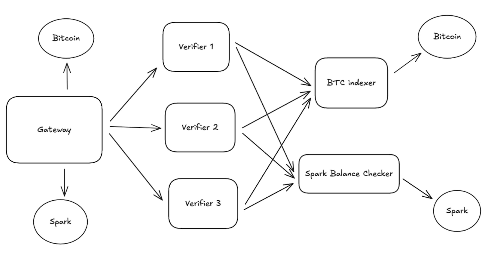

# Runes <-> Spark bridge

This repository contains the implementation of a bridge that allows users to transfer Runes tokens between the Bitcoin and Spark L2.
The bridge utilizes a multi-signature vault mechanism to ensure secure and trustless transfers.

Through this service, users can:
* Safely deposit BTC Runes to receive wrapped Runes (wRunes) on the Spark side;
* Deposit Spark wRunes to redeem BTC Runes back.

## A bit about repository

- `btc_indexer` - service that allows to index Runes transactions and provide tx tracking functionality with callback response after tx finalization;
- `crates` - main utils or useful crates that are used along the repository;
- `docs` - docs and schemes saved for reproducibility;
- `gateway` - main service for resolving user requests and interacting with other services;
- `infrastructure` - folder that contains main config files for both local and production deployment; 
- `spark_balance_checker` - service for checking Spark token balance for given address;
- `tests` - e2e tests that cover main flows;
- `verifier` - folder that contains verifier implementation which can be run in any number of instances.

## How to try it out?

- **Via Docker Compose**

  - Run `docker compose -f ./infrastructure/docker-compose.yml up -d`.

- **Local building**
  - For running everything locally use command `./infrastructure/scripts/run-everything-local.sh`.
  - For stopping it run `./infrastructure/scripts/shut-down-everything-local.sh`.

## Further info

Additional docs you can be found by the [link][1].

[1]: https://docs.google.com/document/d/1fJfDpyc_hQEHg1-W9oYYqUqf3onWqntPGi5kQqC1i0o/edit?usp=sharing

