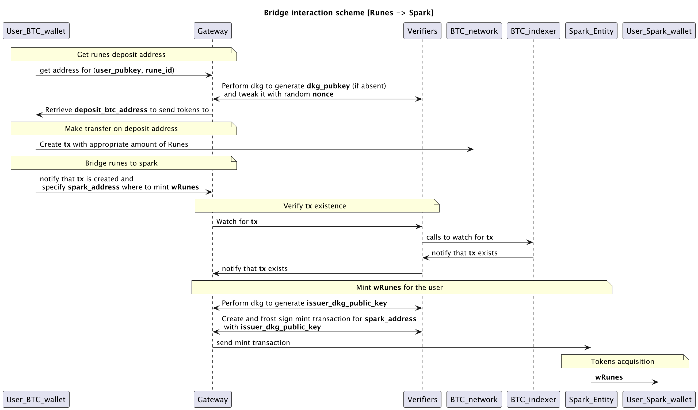
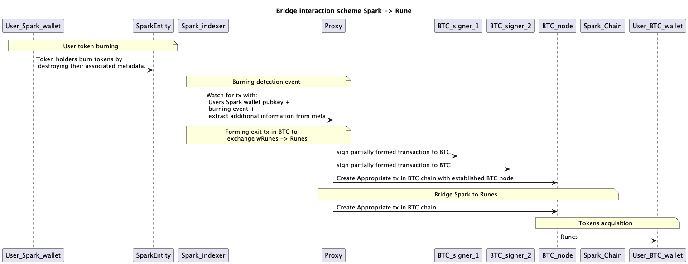

## Bridge docs

First version of bridge [docs][6], but it would be simplified for the first implementation.

### Bridge Wallets

First of all, we need to create a bridge wallet for each side of the bridge.
It'd contain 
* Runes that users will transform into wrapped Runes _(wRunes)_ tokens on Spark
* Spark wRunes tokens that users will transfer from Spark chain

There would be **M** verifier nodes that'd track BTC transaction made from specific user's pubkey.
Between those nodes would be generated a shared secret (ROAST/FROST) that would be used to sign the transaction on Spark side.

_By now **M** is equal to 2._

### Runes -> Spark

[Runes handbook][4], [Ordinals theory][5]

---
_User initiates bridging of Runes into Spark (wRunes analogous)_

1) User transfers its own pubkey + additional information to create [tweak pubkey][3] for tracking transactions.
Creates a deposit transaction sending Runes to an address derived from the validators’ group key.
We'd change it with usage of additional multiplication parameter:  
`t = user_pubkey|amount_in|rune_id|uuid` in bytes that is transformed into a multiplication scalar for representing tweaked pubkey of bridge account`(x'=x+t)`.
In this way we can clearly define which user is making a deposit and how much it is.

---
_Verifying user intentions on bridging Runes into Spark (wRunes analogous)_

2) Verifier_BTC and Indexer(inside Verifier) spot the deposit; waits >= 6 confirmations. 
Validators after subscribing event. 
After the operator-defined finality window (e.g., 6 blocks), the out-point is irreversible. Proxy waits for response from Verifiers and aggregate event from them. Once ≥ M attestations, intent is locked.
--- 
_Signer builds a Spark `mint(user_spark, amt, rune_id, intent_id)` TTXO and collects ≥ M operator sigs._

3) Proxy, after receiving appropriate event about spot deposit, initiates minting process.
It waits for **M** partial signatures from Spark_signer_M, merges them into a single 64-byte Schnorr signature (σ), and constructs a Spark “Mint TTXO” that:
    * Credits the user’s Spark address with the same amount and rune_id.
    * Embeds the DepositProof in an auxiliary field.
    * Is signed with σ under PKᴳ.

4) Spark rollup node / operator set: Validates the aggregate signature and bridge rules, then includes the Mint TTXO in the next Spark block.

5) User’s Spark wallet: Detects the new block and displays the newly minted wRunes tokens. 
The deposit is complete; the Bitcoin vault balance has increased by the same amount now present on Spark.

---
wRunes - are tokens created with BTKN [program][7]
User’s Spark wallet - derived from its pubkey

### Spark -> Runes

Here we'd use [Cooperative exit][1] with the help ot [SE][2]. 

---
_User initiates bridging of Spark (wRunes) into Runes_

1) User sends a [burn transaction][8] transferring the chosen amount of BTKN tokens (from User’s Spark wallet) back to the Bridge-Vault address on Spark and includes the user’s desired Bitcoin in the metadata.

--- 
_Burning transferred tokens_

2) After receiving tokens on bridge account, burning process in initiated.
Obtaining additional information from BurnReceipt: `{spark_txid, ttxo_index, amount, rune_id, dest PKᵣ}`.
3) Burning is initiated by token owner (bridge account) by sending burning token [request][8].

---
_Forming of exit transaction in BTC_

4) Form BTC transaction with correct amount of Runes tokens to be transferred to user’s BTC pubkey and appropriate amount of Rnes tokens data in description. Collects t partial signatures, combines them into a single signature, constructs the Bitcoin transaction (including the Runes TRANSFER opcode for the correct asset and quantity), and broadcasts it. Burned tokens are irreversible — they cannot be recovered or reused.
5) Collects t partial signatures, combines them into a single signature, constructs the Bitcoin transaction (including the Runes TRANSFER opcode for the correct asset and quantity), and broadcasts it.
6) Bitcoin full node verifier confirms the vault-spend transaction.
   Once the agreed confirmation depth (e.g., 6 blocks) is reached, the Runes are secure in the user’s L1 wallet.

[1]: https://docs.spark.money/spark/withdrawals#cooperative-exit
[2]: https://docs.spark.money/spark/core-concepts#spark-entity-se
[3]: https://bitcoin.stackexchange.com/questions/113232/what-does-it-mean-to-tweak-a-public-key
[4]: https://book.runesterminal.io/
[5]: https://docs.ordinals.com/runes.html
[6]: https://docs.google.com/document/d/18PfC31R2z18FLDN12VORlb9KTIhpYSanX5gbLuemakU/edit?usp=sharing
[7]: docs.spark.money/lrc20/hello-btkn#what-the-btkn%3F
[8]: https://docs.spark.money/lrc20/burning
